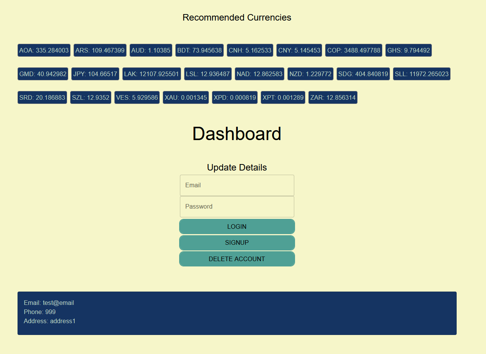

# CS3219 Task B
Student Name: Teo Yick Fong Alex

Student Number: A0221444R

Simple Web app functioning like 'yellow pages' hosted on AWS Elastic Beanstalk

## Instructions for testing on localhost
1. Clone this repository and navigate to backend root `./backend`
1. Run `npm install`
1. Run `npm start`
1. Using Postman, send 'GET', 'POST', 'PUT', 'DELETE' requests to http://localhost:8080/
    1. Import [Postman Collection.json](./Postman%20Collection.json) to postman
	1. Change variable `URL` to local endpoint
	1. Run collection
	1. *** - Setup: Ignore, used to set up for some tests
	1. *** - Valid: Should return HTTP codes 200+
	1. *** - Invalid: Should return HTTP codes 400+
2. To run tests, run `npm test`

## Instructions for testing on deployed endpoint
1. Using Postman, send 'GET', 'POST', 'PUT', 'DELETE' requests to [http://mytestapp25846-env.eba-2byxqhms.ap-southeast-1.elasticbeanstalk.com/](http://mytestapp25846-env.eba-2byxqhms.ap-southeast-1.elasticbeanstalk.com/)
	1. Import [Postman Collection.json](./Postman%20Collection.json) to postman
	1. Change variable `URL` to deployed endpoint
	1. Run collection
	1. *** - Setup: Ignore, used to set up for some tests
	1. *** - Valid: Should return HTTP codes 200+
	1. *** - Invalid: Should return HTTP codes 400+
1. To view CI test results, go to: [link](https://github.com/alexteo98/test-25846/actions)
1. Click on specified workflow -> Continuous Testing -> Run workflow

## Instruction to set up frontend
1. Clone this repository and navigate to frontend root `./frontend`
1. Run `npm install --force`
1. Run `npm start`

## Serverless Function
1. This serverless function pulls all exchange rates around the world for the past 3 months and returns the currencies whose current rates are better than 1.05x the average of the past 3 months.
2. Function URL: [here](https://nazyxywbs2lgv7pea34636c7d40smpmi.lambda-url.ap-southeast-1.on.aws/)
3. Data is displayed at the top of the frontend for easy viewing

## Task B1 - Backend
- [x] Successful GET, POST, PUT, DELETE API calls on localhost
- [x] Successful GET, POST, PUT, DELETE API calls to deployed endpoints (AWS)
- [x] Handle common edge cases and error-resiliency

## Task B2.1 - Continuous Testing 
- [x] Successful testing for API using Mocha/Chai
- [x] Use Github Actions to automate testing

## Task B2.2 - Continuous Deployment
- [x] Use Github Actions to automatically deploy to AWS Elastic Beanstalk

## Task B3 - Frontend
- [x] Interact with the API using the frontend
- [x] Implementation of style e.g., using Bootstrap

## Task B4 - Pull data from serverless function
- [x] Deploying a serverless function to AWS Lambda
- [x] Ability to interact with the serverless API using the frontend

